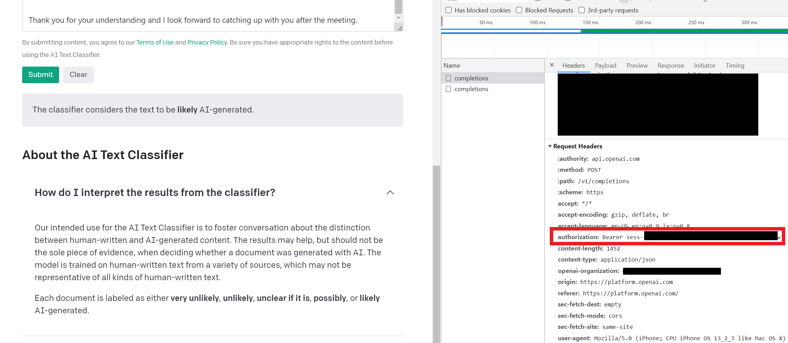

# ChatGPT Email Detector	

*This repo utilizes the work of [Openai-Detector](https://github.com/promptslab/openai-detector).*

Discover if someone is sending you an email using ChatGPT! With each new email, this script will give you the likelihood that the email was authored using OpenAI's ChatGPT.

### Installation

*Python and pip will be required to use this directory. Currently this code only works with Microsoft Outlook.*

After cloning or downloading this repository, you will need to access your OpenAI Bearer token. Having an OpenAI account is required for this step. If you don't have an account, sign up [here](https://platform.openai.com/signup/)

To retrieve your bearer token you will need to:

1. Go to https://platform.openai.com/ai-text-classifier 

2. Hit F12 to access the Developer tools (or right-click and Inspect)

3. Select the Network Tab

4. Paste text into detection box and click on submit

5. Click on 'completions' in the Network tab

6. Find your current Bearer token in the Request Headers

   

Your Bearer token should look something like 'Bearer sess-xxxxx'

Create a text file in this directory called my_token.txt and store your Bearer token there. An example token file is included in this repository. *The example is only to showcase syntax, the token itself will not work with this code*.

### Run this software

Install required libraries (a virtual environment is encouraged) using

`pip install -r requirements.txt`

You can then run this repo with

`python listener.py`

With each new email, you will see

- who sent it
- the subject line
- the probability this email was generated by AI
- the 'likelihood' that this email was generated by AI. The five likelihood labels, as defined by Open AI are:
  - 'very unlikely', 0%-45%
  - 'unlikely', 45%-90%
  - 'unclear if it is', 90%-98%
  - 'possibly', 98%-99%
  - 'likely', 99%-100%

